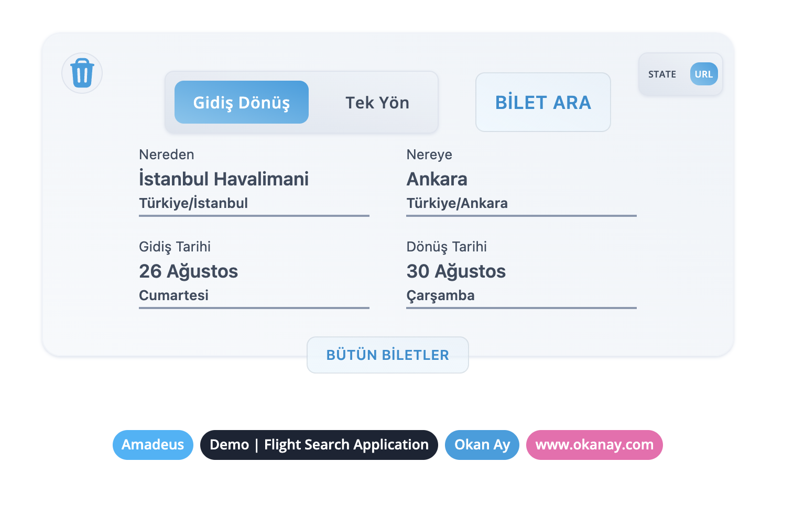
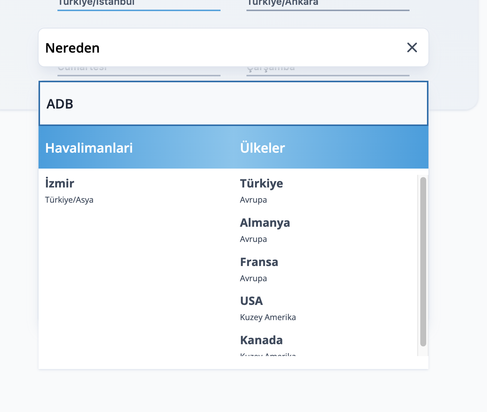
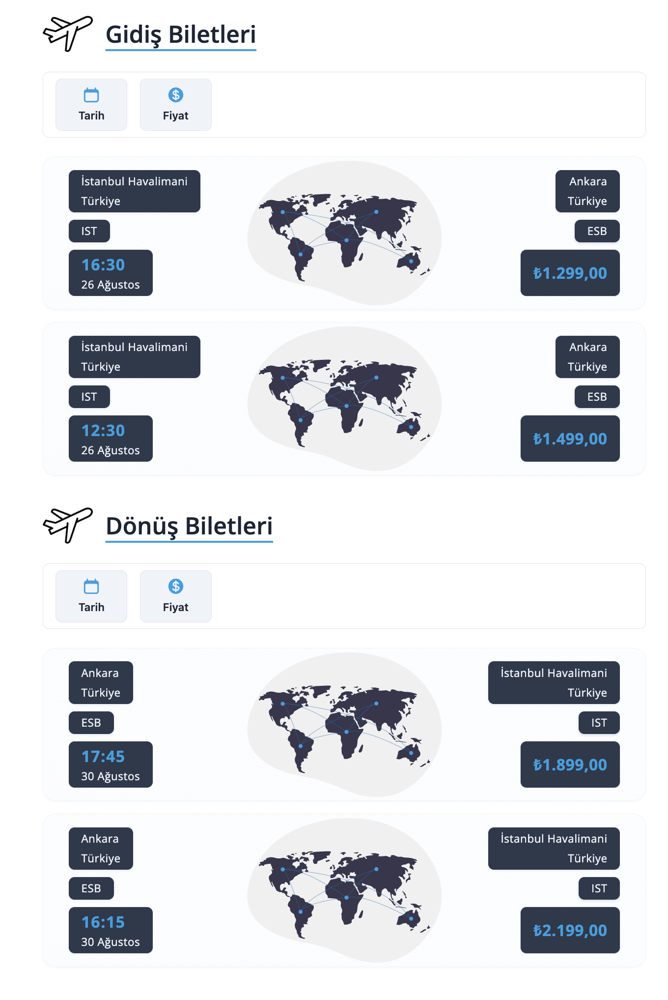
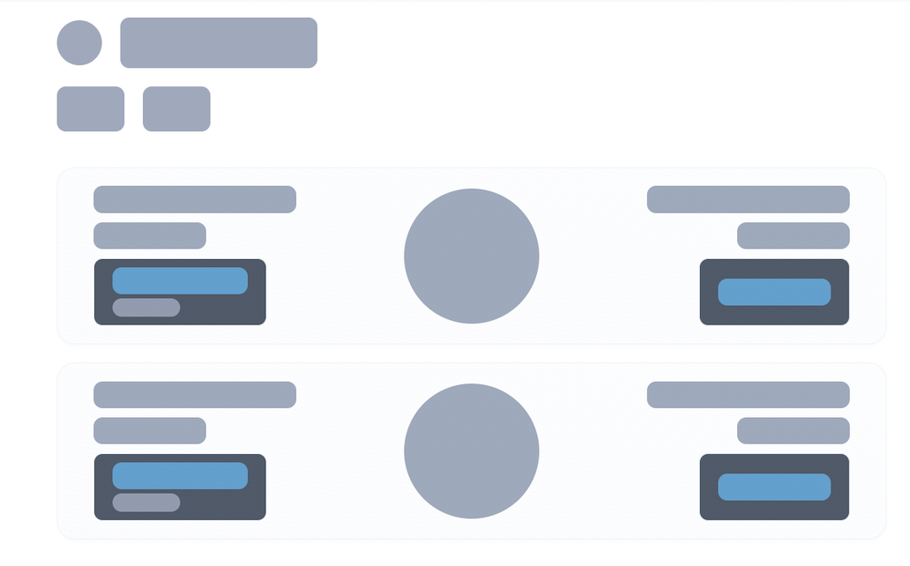

This is a [Next JS v13.4](https://nextjs.org/)  project


**### `STATIC` `MIN` and `MAX` [`DatePicker`](https://github.com/okanay/flight-search-application/blob/318da71238b5f38f80652045166acd9611e1542b/src/components/UI/Date/DatePicker.tsx) Time for Mock TicketsData**


`../libs/helpers/TicketFinder.tsx`

```bash
export const caseStartDate = new Date('2023-08-25T00:00:00Z')
export const caseEndDate = new Date('2023-09-15T00:00:00Z')
```

### **Recommended Params**

### **Destination Picker**

### **Date Picker**

### **Result**

### **Search Type**
#### **This toggle sets the search concept. If the button stays as "URL", you can search for tickets by creating searchParams.**

### **Loading Skeleton**

### **Error**


